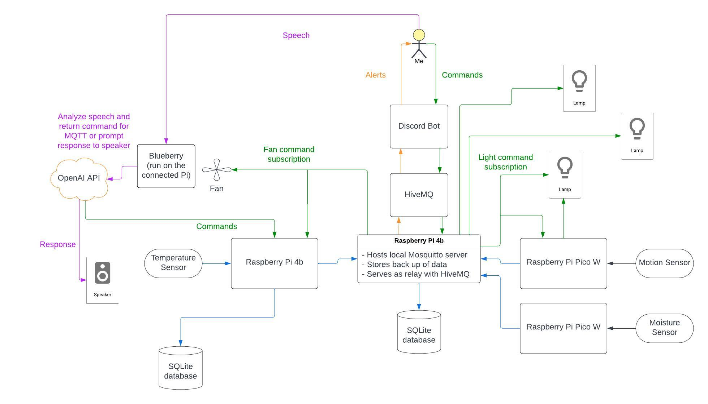

# RPi_Home: DIY Smart Home Automation

## Welcome!

Thanks for checking out my smart home project! This project uses a few types of Raspberry Pi's and IoT devices to create a DIY smart home and assistant, "Blueberry".

 |  

## Overview 

### Background
For a little background, this project began as a way to just turn on a fan when it got hot. I wanted to get a notifcation when it got too hot at home when I was out and a way to turn on a fan to help lower the temperature for my dog while I'm not home. I had a Raspberry Pi sitting around, so I attached a temperature sensor, and then made a Discord bot to alert me. I deployed the bot on Heroku and used HiveMQ for an MQTT broker. Next, I bought a Sonoff R2, soldered on some headers, flashed it with Tasmota, attached a box fan, set up a local Mosquitto server for MQTT communication between the R2 and Raspberry Pi, looped in some commands to the bot, and I had my working pipeline. 

### Current Set Up

#### Devices
After getting my original idea set up, I got working on, and am actively adding pieces to, other components to turn my apartment into a DIY smart home. You can see this diagram for a general overview of the current set up

 - One Raspberry Pi 4b that hosts the local Mosquitto server and handles the commands from the Discord bot
    - Also has a local SQLite database to back up data readings

- Second Pi 4b that gets temperature readings and sends alerts based on them. This also runs the home assistant "Blueberry".
    - Stores its data in a local SQLite database while also sending it to the brain Pi for backup storage
    - "Blueberry" uses Porcupine for a wake word ("blueberry") and anaylzes the speech using the OpenAI speech to text API. It then either sends a command to a device or sends a prompt back to the OpenAI text generation API. The physical set up right now is pretty rinky dink but I plan on adding some better animatronics once I get the parts. 
    - Below are videos demonstrating the commands/ LLM integration. The speakers were just the cheapest ones I could find, so there is some constant noise.

  
  

- Pico W with a motion sensor by my door is used to turn on a lamp connected to a Sonoff R2 when I get home and when I leave
    - The lamp is also commandable from the bot

- Pico W with a moisture sensor sends alerts about plant watering

- Other Tasmota flashed Sonoff devices - if it's just commands that need to be sent from the bot, it's easy to keep adding them

#### Code
- I use some common classes and topics as a package for the different devices
    - While there's only one device for each of the sensors at the moment, this makes for a reusable and easily expandable codebase

### Next Up
Stay tuned for additional functionalities added, and feel free to use this code base for your own smart home.

To Do List:
- Right Now:
    - Continue to expand the virtual assistant 
    - Clean up the Pi 4b with assistant and temperature sensor to run with the same script

- Short Term:
    - Clean up the Pi 4 code and topics
    - Add camera to the device list
    - Add animatronics for assistant
    
- Medium Term:
    - Use a hosted database for a central source of data / make API
    - Make a dashboard for computer with graphs, command options, etc.

If you have any ideas for further expansions or improvements, please let me know!